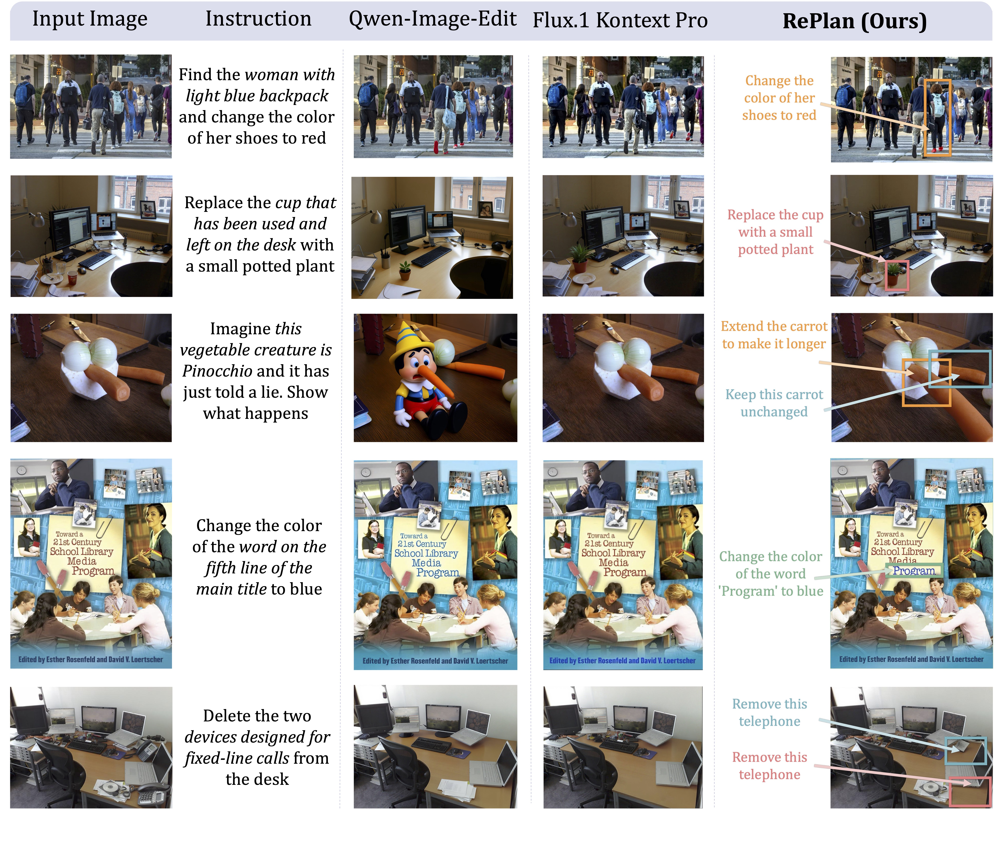
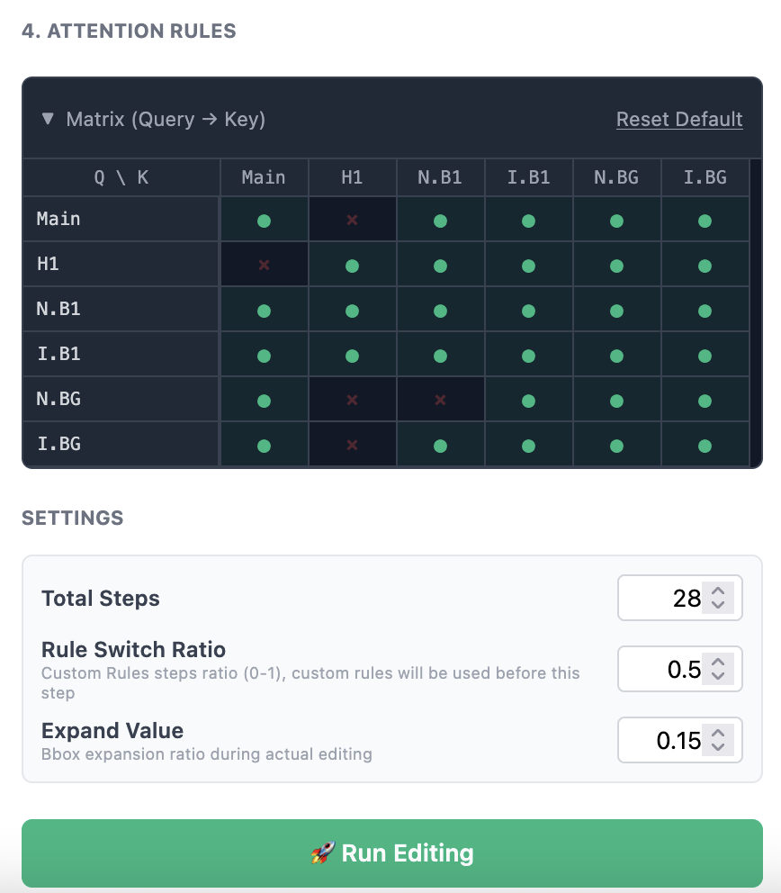
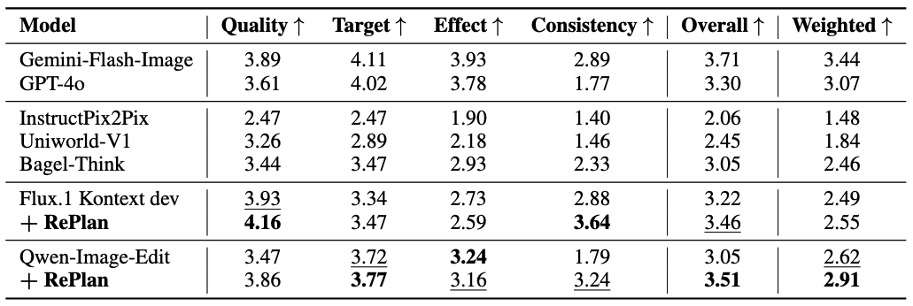

<div align="center">

<h1>RePlan: Reasoning-Guided Region Planning <br> for Complex Instruction-Based Image Editing</h1>


<p align="center">
  <a href="https://replan-iv-edit.github.io/">
    
  </a>&nbsp;&nbsp;&nbsp;&nbsp;
  <a href="https://arxiv.org/abs/2512.16864">
    
  </a>&nbsp;&nbsp;&nbsp;&nbsp;
  <a href="https://huggingface.co/datasets/TainU/IV-Edit">
    
  </a>&nbsp;&nbsp;&nbsp;&nbsp;
  <a href="https://huggingface.co/TainU/RePlan-Qwen2.5-VL-7B">
    
  </a>
</p>

<p align="center">
  <strong>From Global Semantics to Region-aligned Guidance</strong>
</p>


## 📖 Overview

**RePlan** is an instruction-based image editing framework designed to conquer **Instruction-Visual Complexity (IV-Complexity)**. By coupling a Multimodal Large Language Model (MLLM) planner with a diffusion-based editor, RePlan shifts the paradigm from coarse global semantics to **Region-aligned Guidance**. It achieves significant improvement in fine-grained visual reasoning and background consistency without requiring massive paired training data.




</div>

## 🔥 News

- [Dec 26th, 2025] We updated the gradio demo for custom attention control and optimized inference settings when using Qwen-Image-Edit as backbone.
- [Dec 19th, 2025] We released paper, model and data of RePlan!


## 📑 Table of Contents

- [📖 Overview](#overview)
- [💡 Introduction](#introduction)
  - [🚧 The Challenge: IV-Complexity](#the-challenge-iv-complexity)
  - [📉 The Gap: Global Semantic Guidance](#the-gap-global-semantic-guidance)
  - [🚀 Our Solution: Region-Aligned Guidance](#our-solution-region-aligned-guidance)
- [🛠️ Environment Setup](#environment-setup)
  - [Installation](#installation)
  - [Environment Options](#environment-options)
- [⚡ Inference](#inference)
  - [Web Interface (Gradio)](#web-interface-gradio)
  - [Command Line Interface](#command-line-interface)
- [📊 Evaluation on IV-Edit Benchmark](#evaluation-on-iv-edit-benchmark)
  - [Evaluation Pipeline](#evaluation-pipeline)
- [🚄 Train Your Own Planner](#train-your-own-planner)
  - [Prerequisites](#prerequisites)
  - [Stage 1: Format and Reasoning Learning](#stage-1-format-and-reasoning-learning)
  - [Stage 2: Planning Learning](#stage-2-planning-learning)
- [📝 Citation](#citation )

## 💡 Introduction

### 🚧 The Challenge: IV-Complexity
Current instruction-based editing models struggle when intricate instructions meet cluttered, realistic scenes—a challenge we define as **Instruction-Visual Complexity (IV-Complexity)**. In these scenarios, high-level global context is insufficient to distinguish specific targets from semantically similar objects (e.g., distinguishing a "used cup" from a clean glass on a messy desk).

### 📉 The Gap: Global Semantic Guidance
Existing methods, including unified VLM-diffusion architectures, predominantly rely on **Global Semantic Guidance**. They compress instructions into global feature vectors, lacking spatial grounding. Consequently, edits often "spill over" into unrelated areas or modify the wrong targets, failing to preserve background consistency.

### 🚀 Our Solution: Region-Aligned Guidance
**RePlan** introduces a **Plan-then-Execute** framework that explicitly links text to pixels. Our key contributions include:

* **🧱 Reasoning-Guided Planning**

    A VLM planner performs **Chain-of-Thought (CoT) reasoning** to decompose complex instructions into structured, region-specific guidance (Bounding Boxes + Local Hints).

* **🎯 Training-Free Attention Injection**

    We introduce a mechanism tailored for Multimodal DiT (MMDiT) that executes edits via region-constrained attention. This enables **precise, multi-region parallel edits** in a single pass while preserving the background, without requiring any training of the DiT backbone.

* **⚡ Efficient GRPO Training**

    We enhance the planner's reasoning capabilities using **Group Relative Policy Optimization (GRPO)**. Remarkably, we achieve strong planning performance using only **~1k instruction-only samples**, bypassing the need for large-scale paired image datasets.

* **🎛️ Interactive & Flexible Editing**

    RePlan's intermediate region guidance is **fully editable**, enabling user-in-the-loop intervention. Users can adjust bounding boxes or hints directly to refine results. Furthermore, our attention mechanism supports **regional negative prompts** to prevent bleeding effects.

* **📊 IV-Edit Benchmark**

    To foster future research, we establish **IV-Edit**, the first benchmark specifically designed to evaluate IV-Complex editing, filling the gap left by current subject-dominated evaluation sets.

---

## 🛠️ Environment Setup

### Installation

First, clone the repository:

```bash
git clone https://github.com/taintaintainu/RePlan-IVEdit-page.git
cd RePlan

```

### Environment Options

#### Option 1: Inference Only

If you only want to run demos or local inference, set up a lightweight environment:

```bash
conda create -n replan_infer python=3.10
conda activate replan_infer
pip install -e .
pip install flash-attn --no-build-isolation

```

#### Option 2: Full Setup (Training & Evaluation)

For full training or evaluation on the IV-Edit benchmark:

```bash
conda create -n replan python=3.10
conda activate replan
pip install -e .[full]
pip install flash-attn --no-build-isolation

```

---

## ⚡ Inference

We provide both a **Web Interface** for interactive visualization/editing and a **Command Line Interface**.

### Web Interface (Gradio)

Launch a local web server to interactively edit images. This interface supports **visualizing and manually modifying** the region guidance (Bounding Boxes & Hints) generated by the planner before execution.

```bash
# use Flux.1 Kontext dev as the backbone
python replan/inference/app.py --server_port 8080 --pipeline_type "flux"

# use Qwen-Image-Edit as the backbone
python replan/inference/app.py --server_port 8080 --pipeline_type "qwen"
```

#### 📺 Demo Video

<div align="center">
<video src="https://github.com/user-attachments/assets/22f73ee5-2f5a-4c4b-9bad-3a2544d844d6" width="80%" controls></video>
</div>


#### 📝 How to Use

1. **Upload & Select**: Click the top-left area to upload an image, or select any provided example.
2. **Baseline Method**: Copy your instruction directly into the **Global Prompt** text box, skip the **AI Plan** step, and click **Run Editing**. The result will be identical to using the baseline model (Flux.1 Kontext dev or Qwen-Image-Edit).
3. **RePlan Method**: Enter your instruction and click **AI Plan**. After a few seconds, the model generates the Global Prompt and Region Guidance. You can see the visual BBoxes (Bounding Boxes) in the interactive interface. Click **Run Editing** to generate the RePlan result.
4. **Manual Correction**: If you are unsatisfied with the AI-generated guidance, you can modify it:
    * **Global Prompt**: Edit the text in the prompt box below the interface.
    * **Move/Resize BBoxes**: Select a BBox in the interactive window to drag it or resize it by dragging its edges.
    * **Add/Delete BBoxes**: Drag on any empty area in the interface to create a new BBox. To delete one, select it and click the **Delete** button in the bottom-right.
    * **Edit Hints**: After selecting a BBox, modify its specific **Local Hint** in the bottom-right text box.
    * Click **Run Editing** to apply your manual changes.


5. **Manual Design**: You can skip the AI Plan entirely. Manually enter a Global Prompt, draw your own BBoxes/Hints using the tools above, and click **Run Editing**.

#### Advanced Controls

<div align="center">

<p><em>Example of advanced control panel. "Main": global prompt. "Hi": Hint i. "N.Bi": Noise of bbox i. "I.Bi": Image of bbox i. "N.BG": Noise of background. "I.BG": Image of background.</em></p>
</div>

1. **Interactive Attention Matrix**: Defines the fine-grained attention mask between specific components to control information flow. **Noise/Image** components distinguish the **Latent Noise Patches** from **Input Image Patches**.

2. **Rule Switch Ratio**: Determines the phase transition point (`0.0` - `1.0`) from **Custom Rules** (defined in 1) to **Default Rules** (depicted in the paper). The cutoff step is calculated as  (e.g., Ratio `0.7` with `50` steps → Custom Rules apply for steps **0–35**).

3. **Locality Control Strategy**: Predefined custom rule of the demo disables **Noise Background → Noise BBox** attention to isolate background from edit target. The **Rule Switch Ratio** controls the duration (number of steps) of this isolation:
    * **Higher Ratio:** Enforces stronger locality. Increase to fix **semantic spillover** (edits leaking into the background).
    * **Lower Ratio:** Allows more global interaction. Decrease to fix **boundary artifacts** (unnatural, sharp edges).

4. **Expand Value**: Expands the effective attention mask relative to the bounding box size (e.g., `0.15` to expand 15% of bbox size).

---

### Command Line Interface

#### Continuous Inference

Launch a session to load the model once and perform multiple inference rounds:

```bash
python replan/inference/run_replan.py --pipeline_type "flux"  # use Flux.1 Kontext dev as RePlan backbone

python replan/inference/run_replan.py --pipeline_type "qwen"  # use Qwen-Image-Edit as RePlan backbone

```

#### Single Run

Run inference directly by providing arguments (the program ends after one editing round):

```bash
python replan/inference/run_replan.py \
    --image "assets/cup.png" \
    --instruction "Replace the cup that has been used and left on the desk with a small potted plant" \
    --output_dir "output/inference" \
    --pipeline_type "flux"

```

#### Key Arguments:

  * **`--image`**: Path to the input image (relative or absolute).
  * **`--instruction`**: Editing instruction text.
  * **`--output_dir`**: Directory to save results (default: `./output/inference`).
  * **`--only_save_image`**: If set, only saves the edited image (omits VLM response and visualization).
  * **`--vlm_ckpt_path`**: Path to the Planner VLM checkpoint (default: `TainU/RePlan-Qwen2.5-VL-7B`).
  * **`--pipeline_type`**: Diffusion pipeline type. Supports `flux` (Flux.1 Kontext dev) and `qwen` (Qwen-Image-Edit).
  * **`--lora_path`**: (Experimental) Path to LoRA weights.

---

## 📊 Evaluation on IV-Edit Benchmark

We propose the **IV-Edit Benchmark** to evaluate performance on IV-Complex editing scenarios.

* **Dataset:** ~800 manually verified instruction-image pairs.
* **Capabilities:** Tests 7 referring types (e.g., Spatial, Knowledge) and 16 task types (e.g., Attribute Modification, Physics Reasoning). Please refer to the paper appendix for specific categories.
* **Metrics:** We use Gemini-2.5-Pro to evaluate **Target**, **Consistency**, **Quality**, and **Effect**.

<div align="center">

<p><em>Examples from IV-Edit spanning a wide range of real-world scenarios and fine-grained instruction intents, Including spatial, structural, and reasoning-intensive edits.
Each instruction is decomposed into a referring expression and a task type, reflecting the need for
both grounded understanding and visual transformation.</em></p>
</div>

### Evaluation Pipeline

Evaluation consists of two steps: generating edited images and scoring them using Gemini.

#### Step 1: Generation

Generate edited images using the desired backbone. Configuration files control model parameters and output paths.

```bash
# RePlan with Flux backbone
bash replan/eval/scripts/gen_replan.sh replan/eval/config/replan_flux.yaml 

# RePlan with Qwen-Image-Edit
bash replan/eval/scripts/gen_replan.sh replan/eval/config/replan_qwen_image.yaml

# Original Flux.1 Kontext Dev
bash replan/eval/scripts/gen_kontext.sh replan/eval/config/flux_kontext.yaml 

# Original Qwen-Image-Edit
bash replan/eval/scripts/gen_qwen_image.sh replan/eval/config/qwen_image.yaml

# Flux Kontext with Global Instruction Rephrasing (using Qwen)
bash replan/eval/scripts/gen_kontext_rephrase.sh replan/eval/config/qwen_kontext_rephrase.yaml 

```

#### Step 2: Scoring

We use Gemini-2.5-Pro for evaluation.

1. **Configure API**: Update `replan/eval/api_config.yaml` with your credentials. We support:
    * Vertex AI (credential or API key)
    * Google GenAI (API key)
    * OpenAI-compatible 3rd party endpoints


2. **Run Evaluation**:
    ```bash
    python evaluate.py \
        --edited_images_dir ./output/replan_flux \  # Must match the output dir from step 1
        --output_json ./output/replan_flux.json     # Path to save aggregated results

    ```


<div align="center">

<p><em>Quantitative comparison of open-source and proprietary image editing models on four evaluation dimensions. We also report Overall and Weighted scores. For open‑source models, the highest score in each column is marked as Bold, while the second highest is indicated with Underline. RePlan achieves the best consistency and overall score among open-source models.</em></p>
</div>

---

## 🚄 Train Your Own Planner

The RePlan VLM planner is optimized using **Group Relative Policy Optimization (GRPO)** in two stages, requiring only ~1k samples.

### Prerequisites

Ensure full dependencies are installed:

```bash
pip install -e .[full]

```

### Stage 1: Format and Reasoning Learning

Optimizes for valid JSON structure and reasoning chain adequacy using format-related rewards.

```bash
bash replan/train/scripts/grpo_stage1.sh

```

**Convert Checkpoint:**
You may need to convert the saved checkpoint to HuggingFace format:

```bash
python -m replan.train.model_merger --local_dir ./ckpt/easy_r1/stage1/global_step_30/actor

```

### Stage 2: Planning Learning

Uses a large VLM (e.g., Qwen2.5-VL 72B) as a **Reward Model** to evaluate the execution quality (Target, Effect, Consistency) of the generated plans.

We use reward server paradigm for reward calculation, requiring deployment of:

    1. A VLLM server for the VLM reward model.
    2. An editing model server (Kontext).

**1. Start Reward Model Server (VLLM)**
Navigate to the reward function directory:

```bash
cd replan/train/reward_function

```

Launch the VLLM server (example using Qwen2.5-VL-72B on 8 GPUs):

```bash
CUDA_VISIBLE_DEVICES=0,1,2,3,4,5,6,7 vllm serve Qwen/Qwen2.5-VL-72B-Instruct \
    --tensor-parallel-size 8 \
    --max-model-len 4096 \
    --limit-mm-per-prompt '{"image":2}' \
    --disable-mm-preprocessor-cache \
    --gpu-memory-utilization 0.35 \
    --enforce-eager \
    --port 8000

```

*Note: You can use other VLM models or OpenAI-compatible APIs. Smaller models are supported but may degrade reward quality.*

**2. Start Editing Model Server (Kontext)**
Deploy the image editing model. Each specified GPU will host a separate instance for data-parallel inference.

```bash
# Usage: bash start_kontext_server.sh <gpu_ids> <port> 
bash start_kontext_server.sh 0,1,2,3,4,5,6,7 8001

```

*Note: Since the reward and editing servers are accessed sequentially, they can share GPUs if memory permits.*

**3. Configure and Run Training**
Update the server URLs in `replan/train/scripts/grpo_stage2.sh`:

```bash
export KONTEXT_SERVER_URL="http://localhost:8001/v1/images/generations" # Your Kontext server URL
export OPENAI_API_BASE="http://localhost:8000/v1"                       # Your VLLM server URL

```

*(If servers are on different nodes, update `localhost` to the corresponding IP addresses.)*

Launch training:

```bash
bash replan/train/scripts/grpo_stage2.sh

```

**4. Convert Final Checkpoint**

```bash
python -m replan.train.model_merger --local_dir ./ckpt/easy_r1/stage2/global_step_40/actor

```

## 📝 Citation

```
@article{qu2025replan,
      title={RePlan: Reasoning-guided Region Planning for Complex Instruction-based Image Editing}, 
      author={Tianyuan Qu and Lei Ke and Xiaohang Zhan and Longxiang Tang and Yuqi Liu and Bohao Peng and Bei Yu and Dong Yu and Jiaya Jia},
      journal={arXiv preprint arXiv:2512.16864},
      year={2025}
}

```
